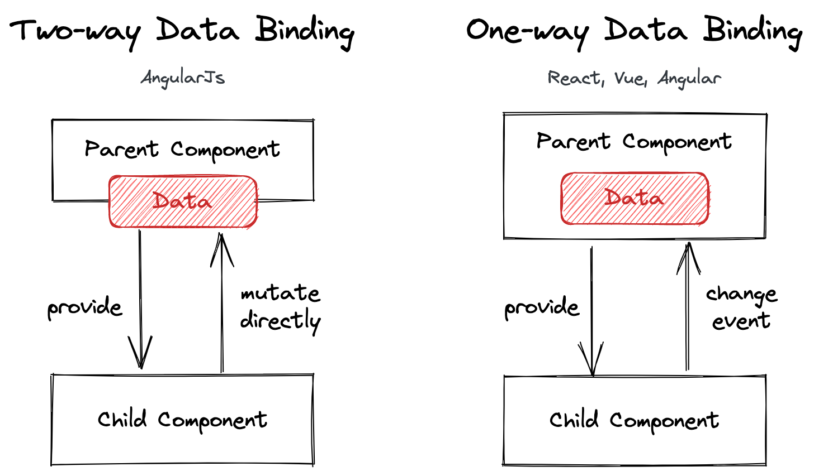
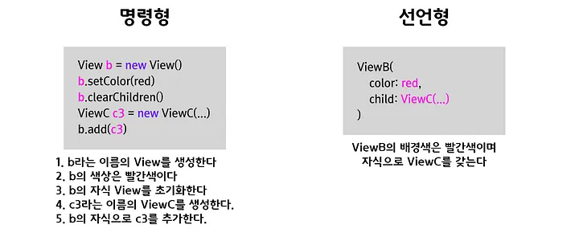

# Vue.js v2.6 Demo

## Vue Instance Lifecycle

- [Diagram](https://v2.vuejs.org/v2/guide/instance.html#Lifecycle-Diagram)
  - beforeCreate
    - created
  - beforeMount
    - mounted
  - beforeUpdate
    - updated
  - beforeDestroy
    - destroyed

## 주요 키워드

### MVVM (model-view-viewmodel)


[이미지 출처: Wikipedia](https://en.wikipedia.org/wiki/Model%E2%80%93view%E2%80%93viewmodel)

- 동작 순서
  - 사용자의 Action들은 View를 통해 들어오게 됩니다.
  - View에 Action이 들어오면, Command 패턴으로 View Model에 Action을 전달합니다.
  - View Model은 Model에게 데이터를 요청합니다.
  - Model은 View Model에게 요청받은 데이터를 응답합니다.
  - View Model은 응답 받은 데이터를 가공하여 저장합니다.
  - View는 View Model과 Data Binding하여 화면을 나타냅니다.

### 양방향 바인딩 (Two-way Data Binding)

[View와 Data의 변화를 상호 반영하는 것](https://poiemaweb.com/angular-component-data-binding)을 말한다.



[이미지 출처: Two-way Data Binding in React](https://sandroroth.com/blog/react-two-way-data-binding)

### 반응형 (Reactive)

데이터가 수정되면 DOM을 업데이트한다.


[이미지 출처: Reactivity in Depth](https://v2.vuejs.org/v2/guide/reactivity.html)

### 선언적 (Declarative)



[이미지 출처: 사람들은 왜 선언형 UI에 열광할까?](https://medium.com/@kimdohun0104/사람들은-왜-선언형-ui에-열광할까-1440d03f4e49)

```dart
// Imperative style
b.setColor(red)
b.clearChildren()
ViewC c3 = new ViewC(...)
b.add(c3)
```

```dart
// Declarative style
return ViewB(
  color: red,
  child: const ViewC(),
);
```

## 상태 관리

- Vuex

## SPA (Single Page Application)

- Vue Router
- Nuxt

## Issues

### IME

[IME 입력이 포함되는 경우](https://vuejs.org/guide/essentials/forms.html#text)
v-model 대신 v-bind와 v-on을 사용한다.
혹은 [커스텀 컴포넌트](https://joshua1988.github.io/web-development/vuejs/v-model-usage/#v-model-%EB%AC%B8%EB%B2%95%EC%9D%84-%EC%9D%B4%EC%9A%A9%ED%95%B4%EC%84%9C-%ED%95%9C%EA%B5%AD%EC%96%B4%EB%A5%BC-%EC%B2%98%EB%A6%AC%ED%95%A0-%EC%88%9C-%EC%97%86%EC%9D%84%EA%B9%8C%EC%9A%94)를 생성한다.

> For languages that require an [IME](https://en.wikipedia.org/wiki/Input_method) (Chinese, Japanese, Korean etc.),
> you'll notice that `v-model` doesn't get updated during IME composition.
> If you want to respond to these updates as well, use your own `input` event listener and `value` binding instead of using `v-model`.

```html
<!--one-way-->
<input v-bind:type="type" :value="inputText"><br/>
<!--two-way-->
<input v-bind:type="type" :value="inputText" v-on:input="updateInput"><br/>
<input v-bind:type="type" v-model="inputText"><br/>
```

### memory Leak

- [Avoiding Memory Leaks](https://v2.vuejs.org/v2/cookbook/avoiding-memory-leaks.html)

# 참조

- [Vue.js 2.x Guide](https://v2.vuejs.org/v2/guide/)
  - [Vue.js 2.x API](https://v2.vuejs.org/v2/api/)
- [Vue.js 2 유튜브 강의](https://www.youtube.com/playlist?list=PLB7CpjPWqHOtYP7P_0Ls9XNed0NLvmkAh) - 코지 코더
- Vue 라이프사이클
  - [Vue 라이프사이클 이해하기](https://wormwlrm.github.io/2018/12/29/Understanding-Vue-Lifecycle-hooks.html) - 재그지그
- Vue 3
  - [Can I use ... Vue 3?](https://youtu.be/Z0OG00YQeMg) - 장기효(캡틴판교), NAVER | FEConf Korea 2020
  - [Exciting new features in Vue 3](https://vueschool.io/articles/vuejs-tutorials/exciting-new-features-in-vue-3/) - Vue School
  - [Vue, 원피스로 떠나는 여정](https://saramin.github.io/2021-12-15-vue2-vs-vue3/) - 사람인HR
  - [Vue.js 3.0 무엇이 달라졌는가?](https://www.samsungsds.com/kr/insights/vue_js_3.html) - Samsung SDS
  - [Vue 2.7 Naruto 공식 릴리즈](https://ryuhojin.tistory.com/34) - ryuhojin
- MVVM
  - [Model-View-ViewModel (MVVM)](https://learn.microsoft.com/en-us/dotnet/architecture/maui/mvvm) - Microsoft
  - [MVC, MVP, MVVM 비교](https://beomy.tistory.com/43) - 버미노트
- 양방향 바인딩 (Two-way Data Binding)
  - [Two-way Data Binding in React](https://sandroroth.com/blog/react-two-way-data-binding) - Sandro Roth
  - [0.7KB로 Vue와 같은 반응형 시스템 만들기](https://ui.toast.com/weekly-pick/ko_20190531) - TOAST UI
  - [Vue.js 3 반응형 동작 원리 살펴보기](https://ui.toast.com/weekly-pick/ko_20210112) - TOAST UI
  - [프레임워크별 양방형 바인딩](https://gitnyang.tistory.com/67) - ddooyn.log
- 반응형 (Reactive)
  - [SolidJS와 함께 되짚어보는 반응형 프로그래밍](https://ui.toast.com/posts/ko_20220331) - TOAST UI
  - [(en) Reactivity in Depth](https://v2.vuejs.org/v2/guide/reactivity.html) - Vue.js
    - [(ko) 반응형에 대해 깊이 알아보기](https://ssafy-vue.xyz/v2/guide/reactivity.html) - Vue.js
- 선언적 UI
  - [사람들은 왜 선언형 UI에 열광할까?](https://medium.com/@kimdohun0104/%EC%82%AC%EB%9E%8C%EB%93%A4%EC%9D%80-%EC%99%9C-%EC%84%A0%EC%96%B8%ED%98%95-ui%EC%97%90-%EC%97%B4%EA%B4%91%ED%95%A0%EA%B9%8C-1440d03f4e49) - kimdohun0104
- Virtual DOM
  - [[번역] 리액트에 대해서 그 누구도 제대로 설명하기 어려운 것 – 왜 Virtual DOM 인가?](https://velopert.com/3236) - velopert
  - [리액트의 Virtual DOM 이란? (리액트가 빠른 이유)](https://simsimjae.tistory.com/397) - 심심재
  - [브라우저 로딩 과정](https://simsimjae.tistory.com/388) - 심심재
  - [브라우저는 어떻게 동작하는가?](https://d2.naver.com/helloworld/59361) - NAVER D2
  - [ReactJS의 Virtual DOM과 Repaint, Reflow](https://blog.drakejin.me/React-VirtualDOM-And-Repaint-Reflow/) - DrakeJin
  - [DOM과 Virtual Dom이란?](https://www.howdy-mj.me/dom/what-is-dom) - howdy-mj
